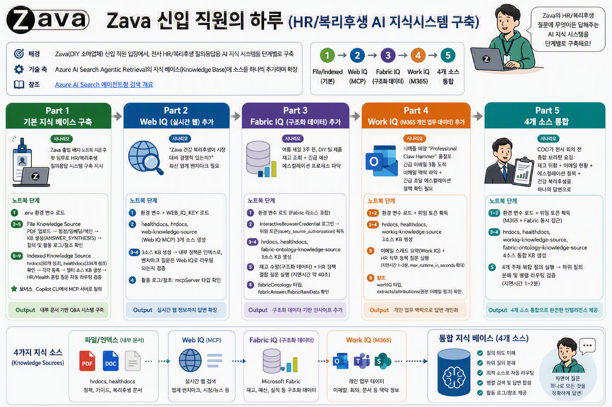

# Microsoft IQ Workshop

> [!NOTE]
> 이 워크샵은 [microsoft/Build26-LAB532-from-data-to-context-agent-ready-knowledge-with-foundry-iq](https://github.com/wonsungso/Build26-LAB532-from-data-to-context-agent-ready-knowledge-with-foundry-iq) 리포지토리를 기반으로 재작성되었으며, Self-paced Lab 형태로 기술 되었습니다. 원본 콘텐츠의 모든 권리는 원저작자에게 있습니다.

## 🔥 Agentic Knowledge Bases 구축 - Next-Level RAG with Azure AI Search

### 워크샵 소개

Zava(DIY 소매업체) 신입 직원이 되어, Azure AI Search 에이전트형 검색의 **지식 베이스(Knowledge Base)** 에 소스를 하나씩 추가하며 HR·복리후생 질의응답 시스템을 확장하는 5단계 실습입니다.

- **Part 1**: File/Indexed Knowledge Source로 기본 지식 베이스 구축
- **Part 2**: Web IQ(MCP)로 실시간 웹 검색 추가
- **Part 3**: Fabric IQ로 구조화된 제품 데이터 추가
- **Part 4**: Work IQ로 M365 개인 업무 데이터 추가
- **Part 5**: 4개 소스를 하나의 지식 베이스로 통합

###  본인 환경에서 시작하기 (Self-Paced Lab)

[./deploy_yourself.md](./deploy_yourself.md) 가이드의 단계를 따르세요.

### 🧠 학습 성과

이 워크샵을 마치면 다음을 할 수 있게 됩니다.

- Azure AI Search 에이전트형 검색을 사용해 색인된 엔터프라이즈 콘텐츠 위에 멀티 소스 지식 베이스를 구축합니다
- Web IQ, Fabric IQ, Work IQ 지식 소스로 지식 베이스를 확장합니다
- 여러 소스 유형(색인된 데이터, 구조화된 데이터, 업무 데이터, 웹 기반 데이터)을 하나의 지식 베이스에 결합합니다
- 인용 기반 답변 합성으로 지식 베이스에 질의합니다

### 💻 사용 기술

1. Foundry IQ (Azure AI Search)
1. Azure OpenAI (gpt-5.4-mini, text-embedding-3-large)
1. Model Context Protocol (MCP)
1. Microsoft Fabric IQ 및 Work IQ
1. Python 및 Jupyter Notebooks

## Copyright

이 프로젝트에는 프로젝트, 제품 또는 서비스에 대한 상표나 로고가 포함될 수 있습니다. Microsoft 상표 또는 로고의 승인된 사용은 [Microsoft 상표 및 브랜드 가이드라인](https://www.microsoft.com/legal/intellectualproperty/trademarks/usage/general)을 따라야 합니다. 이 프로젝트의 수정된 버전에서 Microsoft 상표나 로고를 사용할 때 혼동을 일으키거나 Microsoft의 후원을 암시해서는 안 됩니다. 제3자 상표나 로고의 사용은 해당 제3자의 정책을 따릅니다.
