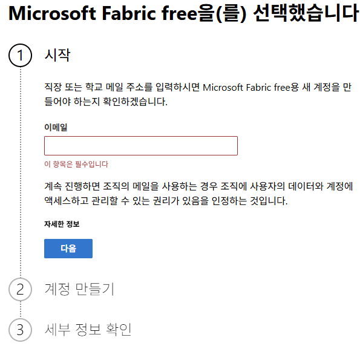
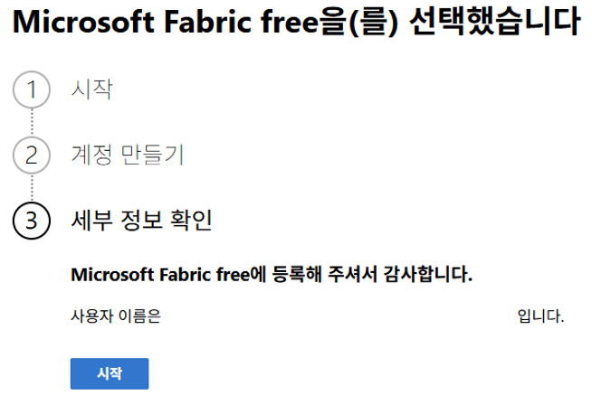
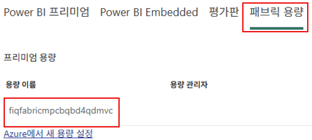
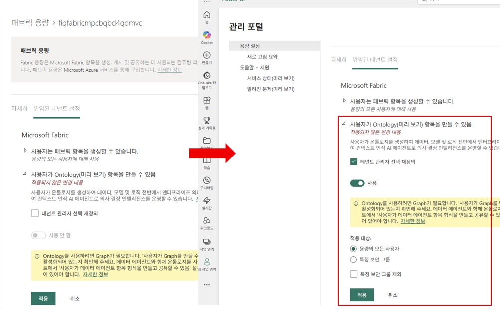

# 내 Azure 구독에 직접 배포하기

이 폴더에는 지식 베이스 인프라를 본인의 Azure 구독에 배포하기 위한 리소스가 들어 있습니다.

## 사전 요구 사항

- 리소스를 생성할 수 있는 충분한 권한이 있는 **Azure 구독**
- **GitHub 계정** (GitHub Codespaces 사용)
- **Microsoft Fabric Free Plan 가입** (Fabric Capacity 배포에 필요)

> 로컬 환경에서 진행하려면 [로컬 환경에서 배포하기](#대안-로컬-환경에서-배포하기) 섹션의 추가 요구 사항을 참고하세요.

### Microsoft Fabric Free Plan 가입

테넌트/계정이 Microsoft Fabric에 가입되어 있지 않으면 Fabric Capacity 리소스 배포 시 `Unauthorized` 오류가 발생합니다. `azd up`을 실행하기 **전에** 아래 절차로 먼저 가입하세요.

1. [https://app.fabric.microsoft.com/](https://app.fabric.microsoft.com/) 에 접속해 로그인합니다
2. 안내에 따라 이메일을 입력하고 Microsoft Fabric free 계정 가입을 완료합니다



3. 아래와 같이 "세부 정보 확인" 단계가 뜨면 가입이 완료된 것입니다. **시작** 버튼을 클릭하세요



### 필요한 Azure 권한

다음 작업을 수행할 권한이 필요합니다.

- 리소스 그룹 생성
- Bicep 템플릿 배포
- 다음 항목의 생성 및 관리:
  - Azure AI Search 서비스
  - Microsoft Foundry 프로젝트
  - Azure OpenAI 모델 배포
- Azure RBAC 역할 할당

## (권장) 빠른 시작 (GitHub Codespaces)

이 리포지토리는 [`.devcontainer/devcontainer.json`](.devcontainer/devcontainer.json)을 통해 Python, Azure CLI, azd, Jupyter 확장이 미리 설치된 Codespace 환경을 제공합니다. 별도 로컬 설치 없이 바로 시작할 수 있습니다.

### 1. 리포지토리 Fork 및 Codespace 생성

여러 실습자가 동시에 진행하므로, 원본 리포지토리가 아닌 **본인 계정으로 Fork한 개인 리포지토리**에서 Codespace를 생성해야 합니다.

- GitHub에서 [wonsungso/ms-four-iq-workshop](https://github.com/wonsungso/ms-four-iq-workshop) 리포지토리로 이동해 우측 상단 **Fork** 버튼으로 본인 계정에 Fork합니다
- Fork된 **본인 리포지토리**(`https://github.com/<본인-계정>/ms-four-iq-workshop`)로 이동합니다
- **Code → Codespaces 탭 → "Create codespace on main"** 을 클릭합니다
- 컨테이너가 빌드되는 동안 잠시 기다립니다(`notebooks/requirements.txt`가 자동으로 설치됩니다)
- Codespace가 열리면 VS Code 웹 또는 데스크톱 앱에서 Terminal을 엽니다(Terminal > New Terminal)

### 2. azd로 배포

```bash
azd auth login --use-device-code
azd env set FABRIC_ADMIN_UPN <실제-로그인한-구독-이메일-주소>
```

다음 환경 설정 값을 입력합니다.

```text
? Enter a unique environment name: [Type ? for hint]  : <alias>-<날짜>
```

```bash
azd up
```

`azd up`을 처음 실행하면 각종 도구 설치 후 아래와 같이 환경 설정/배포 관련 옵션을 입력해주세요 

```text
? Select an Azure Subscription to use:: <사용할 구독 선택>
? Enter a value for the 'location' infrastructure parameter:: 14. (Asia Pacific) Korea Central (koreacentral)
? Pick a resource group to use:: 1. Create a new resource group
? Enter a name for the new resource group:: rg-<alias>-<날짜>
```
> ⏱️ **배포까지 약 20 분의 시간이 소요됩니다.** 잠시 기다려 주세요.

이 명령은 다음을 수행합니다.

- 모든 Azure 리소스 프로비저닝 (AI Search, Foundry 프로젝트, OpenAI 모델, Fabric 용량)
- API 키를 가져와 필요한 모든 변수가 담긴 `.env` 파일 작성
- 검색 인덱스 생성 및 샘플 데이터 업로드
- Zava DIY 데이터셋과 온톨로지로 Fabric Lakehouse 설정

> **참고:** 이메일 시딩(Part 4 - Work IQ용)은 `Mail.Send` 애플리케이션 권한이 있는 서비스 주체가 필요하며 직접 배포 시에는 **실행되지 않습니다**. Part 4에서는 대신 본인의 Mail 데이터를 사용합니다.

### (중요) azd up 진행 중 해야 할 일: Fabric IQ Ontology 기능 활성화

`azd up`이 AI Search/Fabric 용량을 프로비저닝하는 약 20분 동안, **아래 설정을 미리 켜두어야** postprovision 단계에서 Fabric IQ Ontology 생성이 실패하지 않습니다.

1. Azure Portal 에서 방금 생성된 **Fabric 용량** 리소스명을 기억합니다
2. 새 인터넷 창을 열어 **Microsoft Fabric 관리 포털**  [https://app.fabric.microsoft.com/admin-portal/capacities](https://app.fabric.microsoft.com/admin-portal/capacities) 로 이동한 후 **패브릭 용량** 을 선택 해당 용량 이름을 직접 선택 합니다.



3. **위임된 테넌트 설정** 탭에서 **"사용자가 Ontology(미리 보기) 항목을 만들 수 있음"** 항목을 찾습니다
4. **테넌트 관리자 선택 재정의**를 체크하고 토글을 **사용**으로 켠 뒤, 적용 대상은 **"용량의 모든 사용자"** 를 선택하고 **적용**을 클릭합니다



> **참고:** 이 설정이 반영되지 않은 채로 `azd up`이 끝나면 postprovision 단계에서 Fabric Lakehouse/테이블은 생성되지만 **Ontology 생성만 실패**할 수 있습니다. 아래 "(Troubleshooting) Ontology 생성이 실패했다면" 항목을 참고해 재시도하세요.

#### (Troubleshooting) Ontology 생성이 실패했다면

`azd up` 완료 후 로그에 `Creating ontology`나 `TooManyRequestsForCapacity`, `FeatureNotAvailable` 관련 오류가 보인다면, 위 테넌트 설정을 켠 뒤 postprovision만 다시 실행하세요. 이때 이전 실행에서 만들어진 **Fabric Workspace ID를 재사용**해야 워크스페이스가 중복 생성되지 않습니다(터미널 로그의 `Workspace created: <ID>` 또는 `Updated repo root .env with FABRIC_WORKSPACE_ID` 줄에서 확인).

```bash
azd env set FABRIC_WORKSPACE_ID <이전 실행에서 확인한 워크스페이스 ID>
azd hooks run postprovision
```

`azd hooks run postprovision`은 인프라를 다시 배포하지 않고 postprovision 스크립트(인덱스/Fabric Lakehouse/Ontology 설정)만 재실행하므로 `azd up`을 처음부터 다시 돌리는 것보다 훨씬 빠릅니다.

### 3. 워크샵 시작

VS Code에서 [notebooks](./notebooks) 폴더를 열고 **[part1-standard-foundry-iq-kb.ipynb](./notebooks/part1-standard-foundry-iq-kb.ipynb) 부터 시작**하세요.

> ✅ Codespaces로 진행했다면 배포가 모두 끝났습니다. 아래 "로컬 환경에서 배포하기" 섹션은 건너뛰고 바로 노트북을 진행하세요.

---

## (대안) 로컬 환경에서 배포하기

Codespaces 대신 로컬 VS Code에서 진행하려면 다음이 추가로 필요합니다.

- 설치된 **Azure Developer CLI (azd)** ([설치 가이드](https://learn.microsoft.com/azure/developer/azure-developer-cli/install-azd))
- 설치 및 구성된 **Azure CLI** ([설치 가이드](https://learn.microsoft.com/cli/azure/install-azure-cli))
- 설치된 **Python 3.10+**
- **Git** (이 리포지토리를 클론하기 위해)
- Jupyter 확장이 설치된 **VS Code**

또는 로컬에 **Docker**와 VS Code **Dev Containers** 확장이 설치되어 있다면, 클론 후 폴더를 열 때 뜨는 "Reopen in Container" 안내를 선택해 Codespaces와 동일한 컨테이너 환경을 로컬에서 사용할 수 있습니다.

### 1. 리포지토리 클론

```bash
git clone https://github.com/wonsungso/ms-four-iq-workshop.git
cd ms-four-iq-workshop
```

### 2. Python 가상 환경 생성

Dev Container를 사용하는 경우 이 단계는 건너뛰세요(컨테이너 자체가 격리된 환경입니다).

```bash
python3 -m venv .venv
source .venv/bin/activate
```

> **참고 (Windows):** Windows에서는 `venv`가 실행 파일을 `bin/`이 아닌 `Scripts/`에 생성합니다.
>
> ```bash
> source .venv/Scripts/activate
> ```

### 3. azd로 배포 및 워크샵 시작

위 [빠른 시작 (GitHub Codespaces, 권장)](#권장-빠른-시작-github-codespaces)의 2~3단계와 동일하게 `azd auth login`, `azd up`을 실행한 뒤 노트북을 시작하세요.

## 정리

모든 리소스를 삭제하고 지속적인 과금을 피하려면:

```bash
azd down
```

## 추가 리소스

- [Azure AI Search 문서](https://learn.microsoft.com/azure/search/)
- [Azure OpenAI 서비스 문서](https://learn.microsoft.com/azure/ai-services/openai/)
- [Azure Bicep 문서](https://learn.microsoft.com/azure/azure-resource-manager/bicep/)
- [Microsoft Foundry 커뮤니티 Discord](https://aka.ms/AIFoundryDiscord-Ignite25)
