# Azure 구독에 직접 배포하기

이 폴더에는 지식 베이스 인프라를 본인의 Azure 구독에 배포하기 위한 리소스가 들어 있습니다.

## 사전 요구 사항

- 리소스를 생성할 수 있는 충분한 권한이 있는 **Azure 구독**
- **GitHub 계정** (GitHub Codespaces 사용)
- **Microsoft Fabric Free Plan 가입** (Fabric Capacity 배포에 필요)
- **Work IQ 사용량 기반 billing plan 및 조회 사용자 연결** (Part 4/6 실습에 필요)
- **Work IQ API 지출(Spending) 활성화** (Part 4/6 실습에 필요, [Microsoft 365 관리 센터](https://admin.cloud.microsoft/)에서 설정)
- **Work IQ 테넌트 활성화 및 고객 소유 앱 등록** (Part 4/6 실습에 필요, 아래 3번 절차 참고)

> 로컬 환경에서 진행하려면 [로컬 환경에서 배포하기](#대안-로컬-환경에서-배포하기) 섹션의 추가 요구 사항을 참고하세요.

### 1. Microsoft Fabric Free Plan 가입

테넌트/계정이 Microsoft Fabric에 가입되어 있지 않으면 Fabric Capacity 리소스 배포 시 `Unauthorized` 오류가 발생합니다. `azd up`을 실행하기 **전에** 아래 절차로 먼저 가입하세요.

1. [Microsoft Fabric](https://app.fabric.microsoft.com/)에 접속해 로그인합니다
2. 안내에 따라 이메일을 입력하고 Microsoft Fabric free 계정 가입을 완료합니다

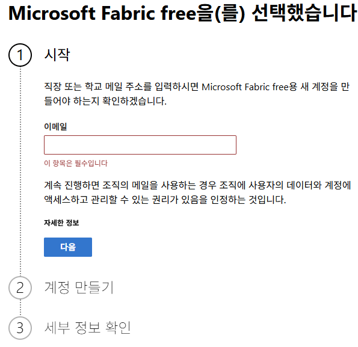

3. 아래와 같이 "세부 정보 확인" 단계가 뜨면 가입이 완료된 것입니다. **시작** 버튼을 클릭하세요

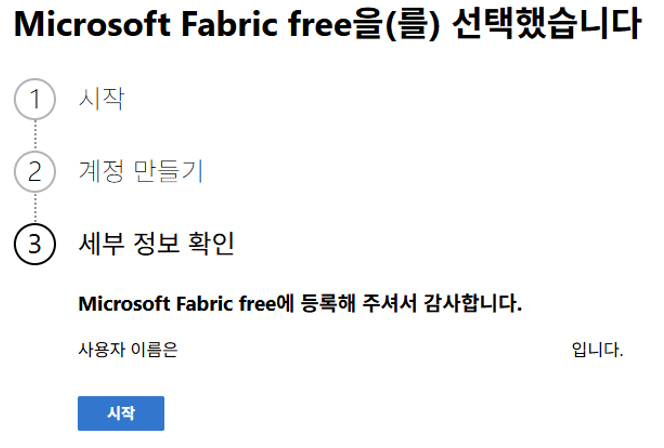

### 2. Work IQ API 지출(Spending) 활성화 (Part 4/6 Work IQ 실습에 필요)

Work IQ를 사용하려면 결제 정책에 **Work IQ API** 서비스와 **실습할 사용자**를 포함해야 합니다. Global Administrator 또는 Billing Administrator가 설정합니다.

1. [Microsoft 365 관리 센터의 Copilot 비용 관리(Cost Management) 페이지](https://admin.cloud.microsoft/#/copilot/costmanagement/configuration)로 이동합니다.
2. **Copilot** → **Cost Management**에서 **Get Started**를 선택합니다.
3. "조직을 위한 기본 지출 정책 활성화" 패널에서 결제 방법(Azure 구독, 없으면 자동 생성 가능), 월별 지출 한도, 알림 등을 설정한 뒤 **Activate**를 클릭합니다.
4. **Agents and services**에서 **Work IQ API**를 선택하고, 정책 대상에 실습할 사용자를 포함합니다.

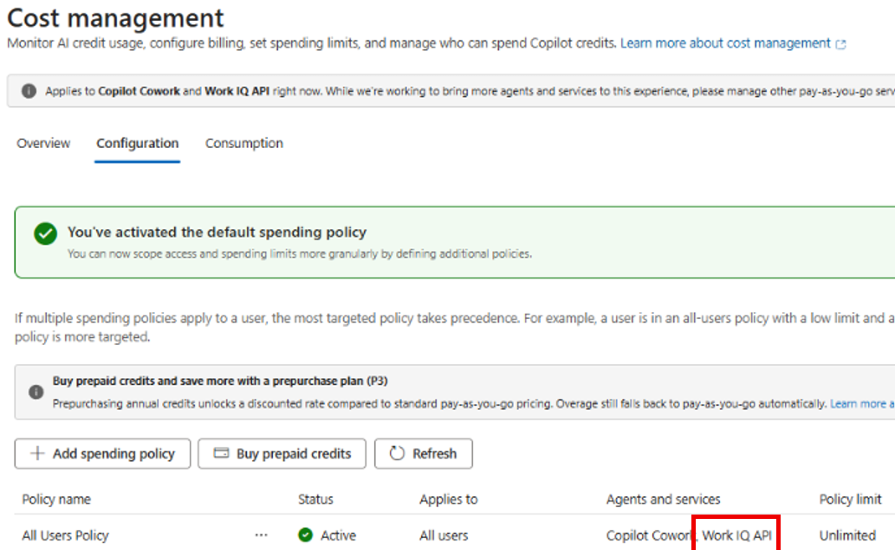

> 설정이 반영되기까지 시간이 걸릴 수 있습니다.

### 3. Work IQ 테넌트 활성화 및 앱 등록 (Part 4/6 Work IQ 실습에 필요)

앱 2개를 등록합니다. 하나는 **Search가 Work IQ에 연결할 앱**, 다른 하나는 **사용자가 로그인할 앱**입니다. 클라이언트 비밀은 필요하지 않습니다.

테넌트 활성화는 Global Administrator가 수행합니다. 앱 등록과 권한 동의는 앱 등록 권한 및 관리자 동의 권한이 있는 관리자에게 요청하세요.

배포 전에는 아래 **테넌트 활성화와 앱 등록**만 완료하세요. Search 연결과 환경 변수 설정은 **Part 4 시작 부분**에서 진행합니다. [공식 설정 문서](https://learn.microsoft.com/en-us/azure/search/agentic-knowledge-source-how-to-work-iq?pivots=python#configure-the-work-iq-app-registration)

#### 3-1. Work IQ 테넌트 활성화

1. [Microsoft Entra 관리 센터](https://entra.microsoft.com/)에서 **Entra ID** → **엔터프라이즈 앱** → **모든 애플리케이션**을 엽니다.
2. **애플리케이션 유형** 필터를 **모든 애플리케이션**으로 바꿉니다. 왼쪽 검색창은 앱 이름 검색용이므로 비워두세요. 오른쪽 **애플리케이션 ID 시작** 필터를 클릭해 아래 ID를 입력하고 **적용**을 누릅니다.

```text
fdcc1f02-fc51-4226-8753-f668596af7f7
```

빨간 테두리의 필터 2개를 설정하면 아래처럼 **Work IQ**가 표시됩니다. 화면의 개체 ID는 예시 값입니다.

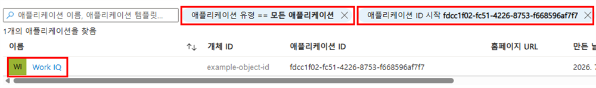

3. 앱이 있으면 **속성**에서 **사용자가 로그인할 수 있도록 설정됨**을 `예`로 설정합니다.
4. 앱이 없다면 Global Administrator가 터미널에서 다음 명령으로 등록합니다. 로그인된 계정의 테넌트 ID를 `WORK_IQ_TENANT_ID` 환경변수에 자동으로 저장해 사용합니다. 아직 로그인하지 않았다면 먼저 `az login`을 실행하세요.

**Codespaces / Bash**

```bash
export WORK_IQ_TENANT_ID="$(az account show --query tenantId --output tsv)"
az login --tenant "${WORK_IQ_TENANT_ID:?테넌트 ID를 가져오지 못했습니다}" --allow-no-subscriptions
az ad sp create --id fdcc1f02-fc51-4226-8753-f668596af7f7
```

> Microsoft 365와 Azure 구독의 테넌트가 다르다면, [Microsoft Entra 관리 센터](https://entra.microsoft.com/)의 **Entra ID → 개요 → 테넌트 ID**에서 Microsoft 365 테넌트 ID를 확인해 `export WORK_IQ_TENANT_ID="<Microsoft-365-테넌트-ID>"`로 지정하세요. 이 변수는 현재 터미널에서만 유지됩니다. 로그인 오류나 권한 오류는 앱이 없다는 뜻이 아닙니다.

참고: [Work IQ 테넌트 활성화](https://learn.microsoft.com/en-us/microsoft-365/copilot/extensibility/work-iq/enable-work-iq)

#### 3-2. 고객 소유 Work IQ 연결 앱 등록

1. [Microsoft Entra 관리 센터](https://entra.microsoft.com/)의 **Entra ID** → **앱 등록** → **새 등록**에서 `fouriq-workiq-api`를 만듭니다. 계정 유형은 **이 조직 디렉터리의 계정만**을 선택합니다.
2. **개요**에서 애플리케이션(클라이언트) ID를 확인합니다. 다음 단계의 URI에 사용합니다.
3. **API 표시** (Expose an API)에서 Application ID URI를 `api://<연결-앱-ID>`로 설정합니다. **범위 추가**를 눌러 이름을 `access_as_user`, 동의 대상을 **관리자만**, 상태를 **사용**으로 설정합니다.
4. **API 권한** → **권한 추가** → **조직에서 사용하는 API**에서 Work IQ API를 찾습니다. 3-1의 ID와 같은 앱인지 확인합니다.
5. **위임된 권한**에서 `WorkIQAgent.Ask`를 추가하고 **관리자 동의 부여**를 클릭합니다.

빨간 테두리의 설정과 동의 상태를 확인하세요. 화면의 식별자는 예시 값입니다.

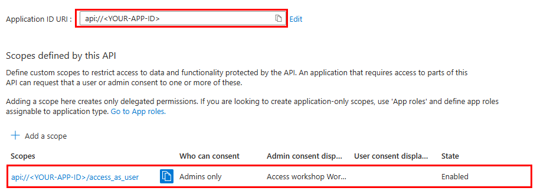

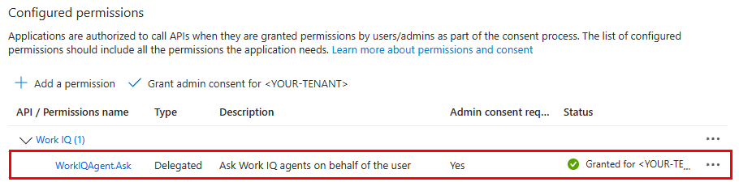

#### 3-3. 사용자 로그인용 클라이언트 앱 구성

1. [Microsoft Entra 관리 센터](https://entra.microsoft.com/)의 **앱 등록** → **새 등록**에서 `fouriq-workiq-client`를 만듭니다. 계정 유형은 **이 조직 디렉터리의 계정만**을 선택합니다.
2. **API 사용 권한** → **권한 추가** → **조직에서 사용하는 API**에서 `fouriq-workiq-api`를 검색합니다.
3. **위임된 권한**에서 `access_as_user`를 추가하고 **관리자 동의 부여**를 클릭합니다.
4. **앱 등록**에서 `fouriq-workiq-client`를 열고 왼쪽 **인증(미리 보기)** (Authentication (Preview))를 선택합니다. **리디렉션 URI 구성** (Redirect URI configuration) 탭의 **리디렉션 URI 추가** (Add Redirect URI)를 클릭합니다.
5. 오른쪽 패널에서 **모바일 및 데스크톱 애플리케이션** (Mobile and desktop applications) 카드의 **선택** (Select)을 누릅니다. **사용자 지정 리디렉션 URI** 입력란에 `http://localhost`를 입력하고 **구성** (Configure)을 누릅니다. 이미 등록돼 있다면 추가하지 않습니다.

> **엔터프라이즈 앱**이 아니라 **앱 등록** 안의 로그인 앱에서 설정합니다. 구형 화면에서는 **인증 → 플랫폼 추가**로 표시됩니다. `http://localhost:8400`도 이 localhost 설정으로 허용됩니다.

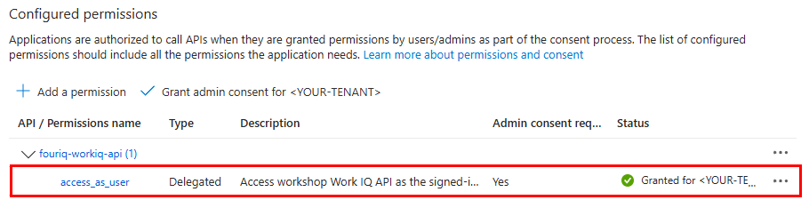

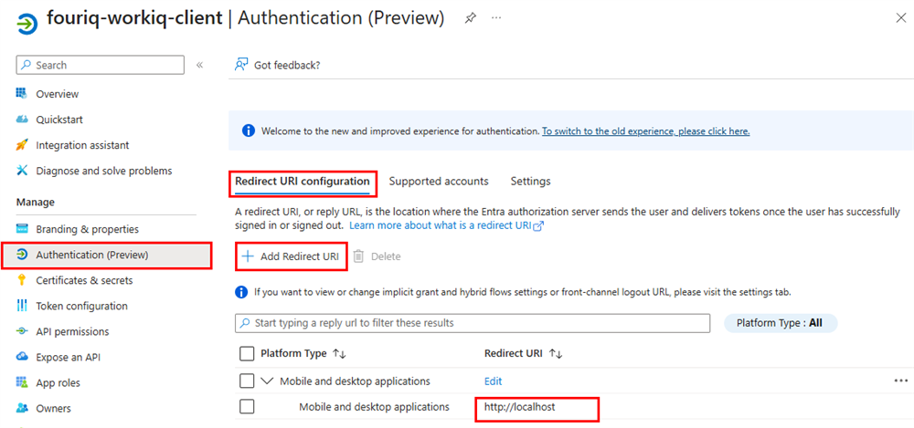

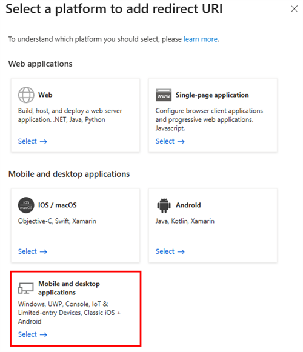

#### 노트북 연결 및 검증

Part 4/6은 `2026-08-01-preview` API를 사용합니다. 필요한 SDK와 MSAL은 초기 환경 설정에서 설치됩니다. 배포 후 Part 1부터 순서대로 진행하고, Part 4의 시작 준비에서 Search 연결을 완료하세요. Part 6에서는 같은 설정을 재사용합니다.

조회 결과에 `workIQ` 참조가 있고 활동 로그에 소스 오류가 없으면 성공입니다. 다른 소스의 답변만 나온 부분 응답은 성공으로 처리하지 않습니다.

| 오류 | 확인할 곳 |
|---|---|
| `AI credits access is not configured for this user` | 2번의 결제 정책에서 Work IQ API, 사용자 포함 여부, 지출 한도 확인 |
| 관리자 동의 또는 로그인 오류 | 3-2와 3-3의 위임 권한 및 관리자 동의 확인 |
| Federated Credential 오류 | Part 4 시작 준비의 Search principal ID와 자격 증명 ID 확인 |
| CLI의 `TokenCreatedWithOutdatedPolicies` | 대상 테넌트에 다시 로그인. 계속 실패하면 관리자에게 로그인 로그 확인 요청 |

### 필요한 Azure 권한


다음 작업을 수행할 권한이 필요합니다.

- 리소스 그룹 생성
- Bicep 템플릿 배포
- 다음 항목의 생성 및 관리:
  - Azure AI Search 서비스
  - Microsoft Foundry 프로젝트
  - Azure OpenAI 모델 배포
- Azure RBAC 역할 할당

## (권장) 빠른 시작 (GitHub Codespaces)

이 리포지토리는 [`.devcontainer/devcontainer.json`](.devcontainer/devcontainer.json)을 통해 Python, Azure CLI, azd, Jupyter 확장이 미리 설치된 Codespace 환경을 제공합니다. 별도 로컬 설치 없이 바로 시작할 수 있습니다.

### 1. 리포지토리 Fork 및 Codespace 생성

여러 실습자가 동시에 진행하므로, 원본 리포지토리가 아닌 **본인 계정으로 Fork한 개인 리포지토리**에서 Codespace를 생성해야 합니다.

- GitHub에서 [wonsungso/ms-four-iq-workshop](https://github.com/wonsungso/ms-four-iq-workshop) 리포지토리로 이동해 우측 상단 **Fork** 버튼으로 본인 계정에 Fork합니다
- Fork된 **본인 리포지토리**(`https://github.com/<본인-계정>/ms-four-iq-workshop`)로 이동합니다
- **Code → Codespaces 탭 → "Create codespace on main"** 을 클릭합니다
- 컨테이너가 빌드되는 동안 잠시 기다립니다. 실습에 필요한 SDK(`azure-search-documents==12.1.0b2`)와 패키지가 자동으로 설치됩니다.
- Codespace가 열리면 VS Code 웹 또는 데스크톱 앱에서 Terminal을 엽니다(Terminal > New Terminal)

### 2. azd로 배포

```bash
azd auth login --use-device-code
azd env set FABRIC_ADMIN_UPN <실제-로그인한-구독-이메일-주소>
```

다음 환경 설정 값을 입력합니다.

```text
? Enter a unique environment name: [Type ? for hint]  : <alias>-<날짜>
```

```bash
azd up
```

`azd up`을 처음 실행하면 각종 도구 설치 후 아래와 같이 환경 설정/배포 관련 옵션을 입력해주세요 

```text
? Select an Azure Subscription to use:: <사용할 구독 선택>
? Enter a value for the 'location' infrastructure parameter:: 15. (Asia Pacific) Korea Central (koreacentral)
? Pick a resource group to use:: 1. Create a new resource group
? Enter a name for the new resource group:: rg-<alias>-<날짜>
```
> ⏱️ **배포까지 약 20 분의 시간이 소요됩니다.** 잠시 기다려 주세요.

> **배포 실패 리소스** 가 있을 시, 완료 후 `azd up` 을 재시도 해주세요.

이 명령은 다음을 수행합니다.

- 모든 Azure 리소스 프로비저닝 (AI Search, Foundry 프로젝트, OpenAI 모델, Fabric 용량)
- Entra ID 인증에 필요한 엔드포인트/배포 이름 등 값이 담긴 `.env` 파일 작성 (API 키는 사용하지 않음)
- 검색 인덱스 생성 및 샘플 데이터 업로드
- Zava DIY 데이터셋과 온톨로지로 Fabric Lakehouse 설정

> **참고:** 이메일 시딩(Part 4 - Work IQ용)은 `Mail.Send` 애플리케이션 권한이 있는 서비스 주체가 필요하며 직접 배포 시에는 **실행되지 않습니다**. Part 4에서는 대신 본인의 Mail 데이터를 사용합니다.

### (중요) azd up 진행 중 해야 할 일: Fabric IQ Ontology 기능 활성화

`azd up`이 AI Search/Fabric 용량을 프로비저닝하는 약 20분 동안, **아래 설정을 미리 켜두어야** postprovision 단계에서 Fabric IQ Ontology 생성이 실패하지 않습니다.

1. [Azure Portal](https://portal.azure.com/)에서 방금 생성된 **Fabric 용량** 리소스명을 기억합니다.
2. [Microsoft Fabric 관리 포털](https://app.fabric.microsoft.com/admin-portal/capacities)로 이동한 후 **패브릭 용량**에서 해당 용량 이름을 선택합니다.

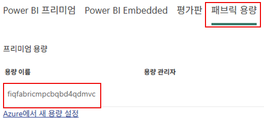

3. **위임된 테넌트 설정** 탭에서 **"사용자가 Ontology(미리 보기) 항목을 만들 수 있음"** 항목을 찾습니다
4. **테넌트 관리자 선택 재정의**를 체크하고 토글을 **사용**으로 켠 뒤, 적용 대상은 **"용량의 모든 사용자"** 를 선택하고 **적용**을 클릭합니다

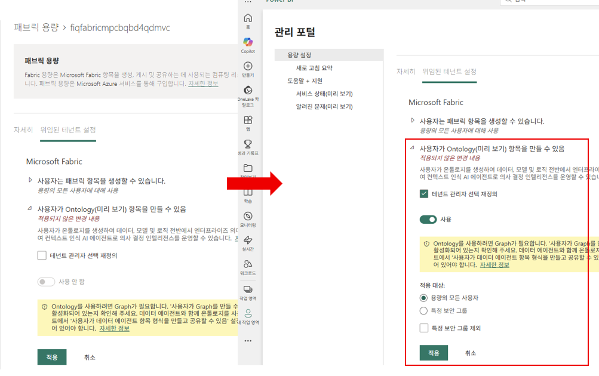

> **참고:** 이 설정이 반영되지 않은 채로 `azd up`이 끝나면 postprovision 단계에서 Fabric Lakehouse/테이블은 생성되지만 **Ontology 생성만 실패**할 수 있습니다. 아래 "(Troubleshooting) Ontology 생성이 실패했다면" 항목을 참고해 재시도하세요.

<details>
<summary>(Troubleshooting) Ontology 생성이 실패했다면</summary>


`azd up` 완료 후 로그에 `Creating ontology`나 `TooManyRequestsForCapacity`, `FeatureNotAvailable` 관련 오류가 보인다면, 위 테넌트 설정을 켠 뒤 postprovision만 다시 실행하세요. 이때 이전 실행에서 만들어진 **Fabric Workspace ID를 재사용**해야 워크스페이스가 중복 생성되지 않습니다(터미널 로그의 `Workspace created: <ID>` 또는 `Updated repo root .env with FABRIC_WORKSPACE_ID` 줄에서 확인).

```bash
azd env set FABRIC_WORKSPACE_ID <이전 실행에서 확인한 워크스페이스 ID>
azd hooks run postprovision
```

`azd hooks run postprovision`은 인프라를 다시 배포하지 않고 postprovision 스크립트(인덱스/Fabric Lakehouse/Ontology 설정)만 재실행하므로 `azd up`을 처음부터 다시 돌리는 것보다 훨씬 빠릅니다.

`ConnectionResetError`나 타임아웃으로 생성 응답을 받지 못해도 Fabric에는 Ontology가 이미 만들어졌을 수 있습니다. 최신 생성 스크립트는 연결 오류가 발생하면 같은 이름의 항목이 실제로 저장됐는지 확인하고 발견된 항목을 재사용합니다. 항목을 찾지 못하면 오류를 그대로 보고합니다. 수동 복구할 때도 포털에서 실제 항목을 먼저 확인하고 해당 ID를 `.env`의 `FABRIC_ONTOLOGY_ID`에 넣어 기존 항목 복구를 실행하세요. 테넌트 기능 설정 오류로 단정하거나 무조건 새 Ontology를 만들지 마세요.

</details>

<details>
<summary>(Troubleshooting) Ontology는 있지만 데이터 원본이 없다는 오류</summary>


`This ontology has no data sources bound to it yet`는 Ontology 항목 생성과 데이터 바인딩 완료가 서로 다르다는 뜻입니다. 새 경험 Ontology는 [TMDL 정의](https://learn.microsoft.com/rest/api/fabric/articles/item-management/definitions/ontology-definition)를 사용합니다. 구형 JSON 정의를 전송한 뒤 HTTP 성공만 확인하면 빈 Ontology가 남을 수 있습니다.

새 경험의 Lakehouse 연결에는 OneLake 연결식과 Fabric 원본 식별 메타데이터가 필요합니다. SQL 연결식과 속성 매핑만 저장하면 엔터티 목록은 보여도 실제 조회는 실패할 수 있습니다. 포털에서 `The kind of Fabric item this data source points to couldn't be identified`가 나타난다면 `ONT_WorkspaceId`, `ONT_ItemId`, `ONT_ItemKind`와 SQL 원본 메타데이터가 누락된 바인딩인지 확인하세요. 복구 스크립트는 포털의 Lakehouse 연결 형식으로 정의를 생성하고 이 메타데이터까지 검증합니다. 복구 중에는 포털의 편집 화면을 닫아 저장되지 않은 변경이 API 업데이트를 덮어쓰지 않도록 합니다.

최신 코드를 받은 뒤 저장소 루트에서 다음을 실행하세요. `.env`의 `FABRIC_WORKSPACE_ID`와 `FABRIC_ONTOLOGY_ID`가 실패한 조회의 ID와 일치하는지 먼저 확인합니다.

```bash
python infra/recreate-fabric-ontology.py --verify-only
python infra/recreate-fabric-ontology.py --repair-existing
python infra/recreate-fabric-ontology.py --verify-only
```

첫 번째 검증이 실패하면 두 번째 명령으로 복구합니다. 복구는 **기존 워크스페이스, Lakehouse, 테이블, Ontology ID를 재사용**하며 인프라를 재배포하거나 테이블을 다시 적재하지 않습니다. Ontology 정의는 워크샵의 4개 엔터티와 바인딩으로 교체하므로 사용자 정의 엔터티를 추가했다면 먼저 정의를 백업하세요. 저장된 정의에서 Lakehouse 연결과 엔터티 속성 매핑을 읽어 확인한 뒤 Search 지식 소스를 동일한 ID로 다시 연결합니다.

Part 3 커널을 다시 시작하고 환경 변수 로드부터 실행하세요. `fabricOntology` 활동에 오류가 없어야 하고 Fabric 참조가 있어야 합니다. HR 문서 검색이나 답변 합성이 성공해도 Fabric 데이터 조회가 실패하면 실습 성공이 아닙니다. Part 5와 Part 6에도 같은 검증을 적용합니다. `--verify-only`는 저장된 바인딩을 확인하며 실제 데이터 조회나 사용자 권한 검증을 대신하지 않습니다.

바인딩 검증이 통과했는데 `Something went wrong while loading the ontology definition` 오류가 계속되면 동일한 복구 명령을 반복하거나 리소스를 재생성하지 마세요. [Microsoft Fabric 포털](https://app.fabric.microsoft.com/)에서 같은 Ontology를 열고 `Product` 엔터티와 데이터 연결을 확인한 뒤, Ontology 에이전트에서 재고 집계 질문을 직접 실행하세요. 엔터티 정의 조회와 자연어 데이터 조회는 서로 다른 검증입니다. 포털에서도 실패하면 Fabric 조회 단계의 원인을 추가로 조사해야 합니다. 포털에서는 성공하고 Search에서만 실패하면 사용자 토큰과 Search 연동을 확인합니다.

</details>

<details>
<summary>(Troubleshooting) Web IQ 또는 Work IQ만 실패하는 경우</summary>


Azure 리소스가 정상 생성돼도 외부 지식 소스의 인증과 사용자 권한이 자동으로 준비되는 것은 아닙니다.

- Web IQ에서 `401 Unauthorized`와 `auth_invalid_api_key`가 나타나면 `.env`의 `WEB_IQ_KEY`를 유효한 키로 교체한 뒤 커널을 다시 시작하고 Web IQ 지식 소스 생성 셀부터 재실행하세요. 저장된 인증 헤더도 갱신해야 합니다. 뒤이어 나타나는 SSE `415 UnsupportedMediaType`는 대체 전송 시도의 오류이므로 먼저 키 인증 실패를 해결합니다.
- Work IQ에서 `AI credits access is not configured for this user`가 나타나면 Microsoft 365 관리자에게 **노트북에 로그인한 사용자**의 AI credits 사용 권한을 요청하세요. Azure 구독 로그인이나 Search 역할만으로 이 권한이 생기지는 않습니다.
- Part 4의 예제 메일 생성은 별도의 Microsoft Graph `Mail.Send` 동의가 필요합니다. 메일 전송을 건너뛰었다면 실제 받은 편지함에서 검색할 수 있는 자료를 사용하고 예제 메일 생성까지 검증했다고 판단하지 마세요.

Part 2, Part 4, Part 5, Part 6은 소스 활동에 오류가 있거나 필요한 Web IQ/Work IQ 참조가 없으면 답변 표시 전에 실패를 보고합니다. 내부 문서나 Fabric 답변만 반환됐다고 전체 실습 성공으로 판단하지 않습니다. 워크샵 데이터의 재고 집계 검증 기준은 `HAND TOOLS`, 총 `stockLevel` **1,635**입니다.

</details>

### 3. 워크샵 시작

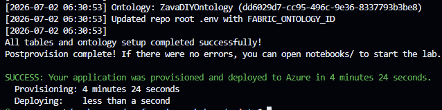

> ✅ Codespaces로 진행했다면 배포가 모두 끝났습니다. 아래 "로컬 환경에서 배포하기" 섹션은 건너뛰고 바로 노트북을 진행하세요.

[Part 4의 시작 준비](notebooks/part4-work-iq-to-kb.ipynb#시작-준비-search-관리-id-연결)에서 Search 관리 ID 연결과 환경 변수 자동 설정을 진행합니다. 배포 가이드로 돌아올 필요 없이 노트북 안의 안내를 따라가세요.

VS Code에서 [notebooks](./notebooks) 폴더를 열고 **[part1-standard-foundry-iq-kb.ipynb](./notebooks/part1-standard-foundry-iq-kb.ipynb) 부터 시작**하세요.

---

<details>
<summary><h2 style="display: inline;">(대안) 로컬 환경에서 배포하기</h2></summary>

Codespaces 대신 로컬 VS Code에서 진행하려면 다음이 추가로 필요합니다.

- 설치된 **Azure Developer CLI (azd)** ([설치 가이드](https://learn.microsoft.com/azure/developer/azure-developer-cli/install-azd))
- 설치 및 구성된 **Azure CLI** ([설치 가이드](https://learn.microsoft.com/cli/azure/install-azure-cli))
- 설치된 **Python 3.10+**
- **Git** (이 리포지토리를 클론하기 위해)
- Jupyter 확장이 설치된 **VS Code**

또는 로컬에 **Docker**와 VS Code **Dev Containers** 확장이 설치되어 있다면, 클론 후 폴더를 열 때 뜨는 "Reopen in Container" 안내를 선택해 Codespaces와 동일한 컨테이너 환경을 로컬에서 사용할 수 있습니다.

### 1. 리포지토리 클론

```bash
git clone https://github.com/wonsungso/ms-four-iq-workshop.git
cd ms-four-iq-workshop
```

### 2. Python 가상 환경 생성 및 패키지 설치

Dev Container를 사용하는 경우 이 단계는 건너뛰세요(컨테이너 자체가 격리된 환경입니다).

```bash
python3 -m venv .venv
source .venv/bin/activate
python -m pip install -r notebooks/requirements.txt
```

> **참고 (Windows):** Windows에서는 `venv`가 실행 파일을 `bin/`이 아닌 `Scripts/`에 생성합니다.
>
> ```bash
> source .venv/Scripts/activate
> ```

노트북을 열기 전에 패키지를 설치하고, 노트북의 Python 환경으로 `.venv`를 선택하세요. 실습용 SDK `azure-search-documents==12.1.0b2`도 함께 설치됩니다.

### 3. azd로 배포 및 워크샵 시작

위 [빠른 시작 (GitHub Codespaces, 권장)](#권장-빠른-시작-github-codespaces)의 2~3단계와 동일하게 `azd auth login`, `azd up`을 실행한 뒤 노트북을 시작하세요.

</details>

## 정리

모든 리소스를 삭제하고 지속적인 과금을 피하려면:

```bash
azd down
```

## 추가 리소스

- [Azure AI Search 문서](https://learn.microsoft.com/azure/search/)
- [Azure OpenAI 서비스 문서](https://learn.microsoft.com/azure/ai-services/openai/)
- [Azure Bicep 문서](https://learn.microsoft.com/azure/azure-resource-manager/bicep/)
- [Microsoft Foundry 커뮤니티 Discord](https://aka.ms/AIFoundryDiscord-Ignite25)
